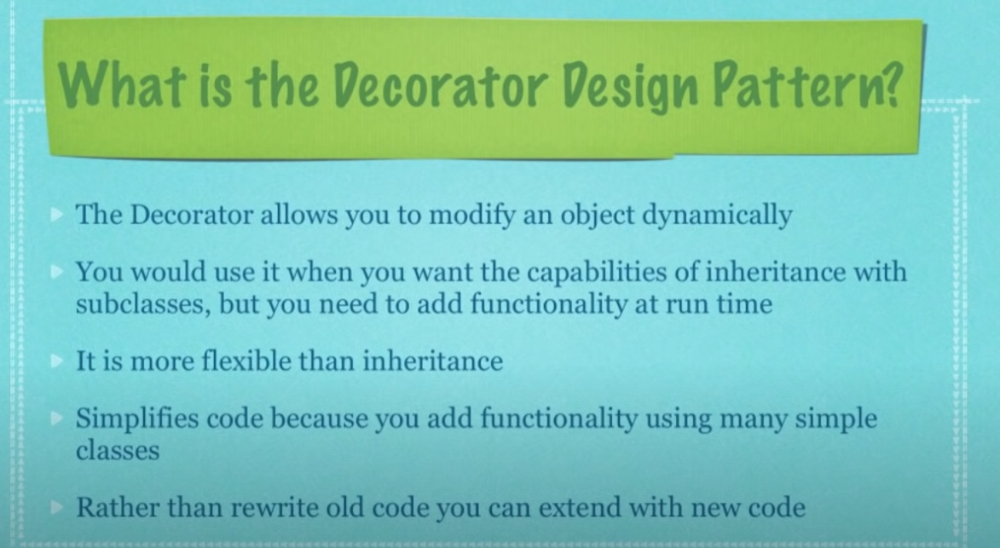
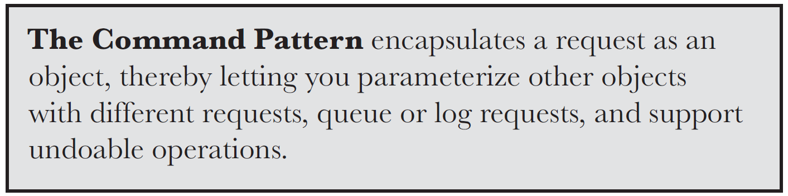
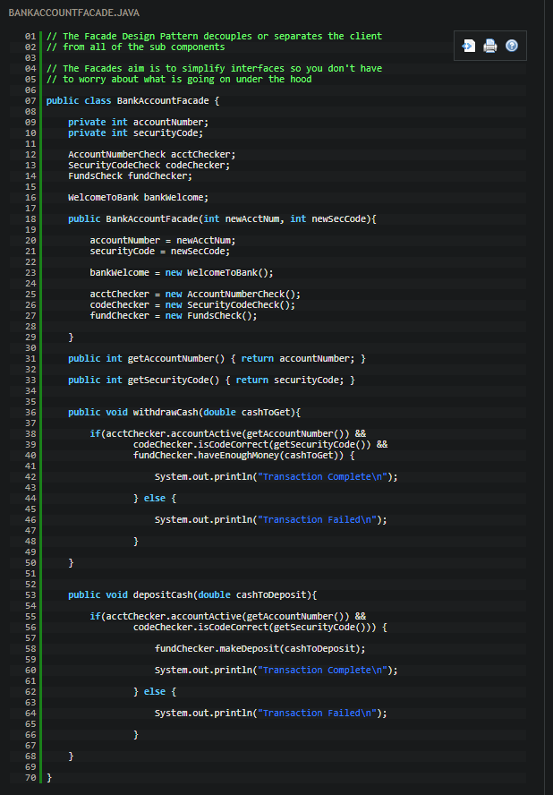
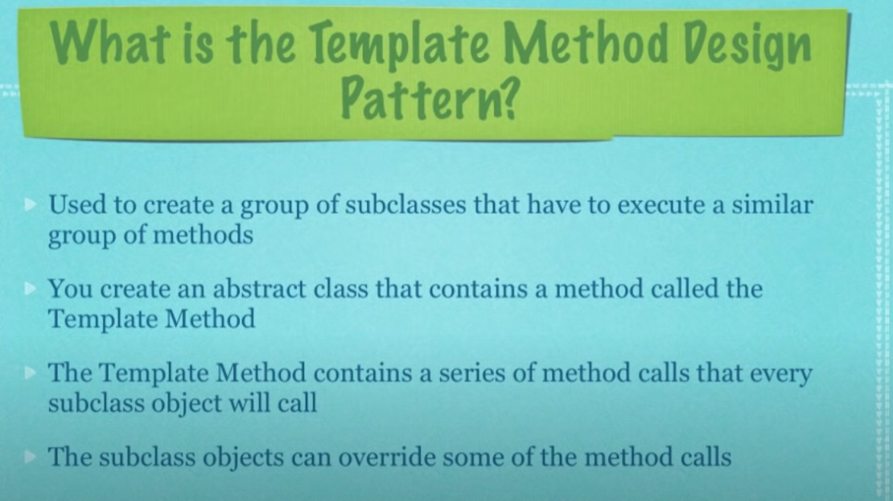
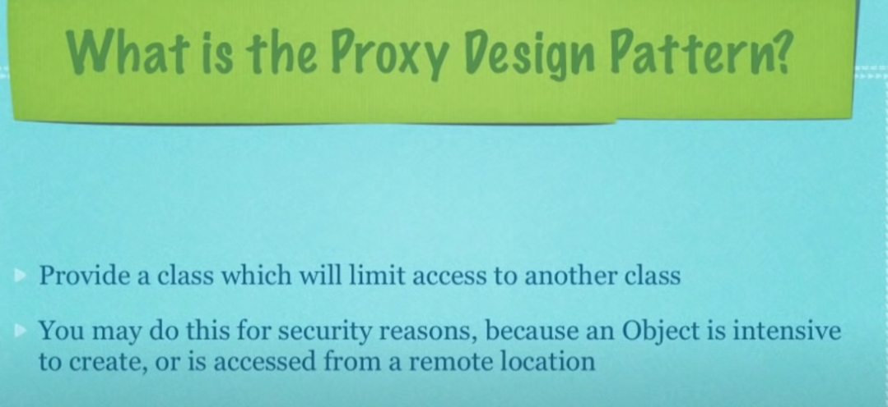

## Topic (to properly understand follow the sequence below in top down)

These are the easy examples of Design patterns.

## [Books](https://drive.google.com/drive/folders/1wKHIAbiG4EueIKT7FHnudrNN4M6SS9UD?usp=sharing)
# Strategy Pattern
The Strategy pattern suggests that you take a class that does something specific in a lot of different ways and extract all of these algorithms into separate classes called strategies. 
 
 
 
 
 

> [Video Explanation](https://youtu.be/v9ejT8FO-7I) based on Head first design pattern book.  
> Now watch the video [implementation](https://youtu.be/-NCgRD9-C6o) of [source code](https://github.com/Mashfy/DesignPattern/tree/master/src/strategy).  
> Brief on [strategy pattern](https://refactoring.guru/design-patterns/strategy).
# Observer Pattern
Observer is a behavioral design pattern that lets you define a subscription mechanism to notify multiple objects about any events that happen to the object they’re observing. 
In this pattern an object, called the subject, maintains a list of dependents, called observers, and notifies them automatically of any state changes in subject, usually by calling one of their method. 
 
 
 
 
 
 
 
> [Video Explanation](https://youtu.be/_BpmfnqjgzQ) based on Head first design pattern book.  
> Now watch the video [implementation](https://youtu.be/wiQdrH2YpT4) of [source code](https://github.com/Mashfy/DesignPattern/tree/master/src/observer).  
> Brief on [Observer pattern](https://refactoring.guru/design-patterns/observer).

# Decorator Pattern
Decorator is a structural design pattern that lets you attach new behaviors to objects by placing these objects inside special wrapper objects that contain the behaviors. 
 
 
 
 
 
 
 

> [Video Explanation](https://youtu.be/GCraGHx6gso) based on Head first design pattern book.  
> Now watch the video [implementation](https://youtu.be/j40kRwSm4VE) of [source code](https://github.com/Mashfy/DesignPattern/tree/master/src/decorator).  
> Brief on [Observer pattern](https://refactoring.guru/design-patterns/decorator).

# Singleton Pattern
Singleton is a creational design pattern that lets you ensure that a class has only one instance, while providing a global access point to this instance. 
 
 
 
 

> [Video Explanation](https://youtu.be/hUE_j6q0LTQ) based on Head first design pattern book.  
> Now watch the video [implementation](https://youtu.be/NZaXM67fxbs) of [source code](https://github.com/Mashfy/DesignPattern/tree/master/src/singleton).  
> Brief on [Observer pattern](https://refactoring.guru/design-patterns/singleton).

# Command Pattern
Command is a behavioral design pattern that turns a request into a stand-alone object that contains all information about the request. This transformation lets you pass requests as a method arguments, delay or queue a request’s execution, and support undoable operations. 
 
 
 
 
 
 
 

> [Video Explanation](https://youtu.be/9qA5kw8dcSU) based on Head first design pattern book and [source code](https://github.com/Mashfy/DesignPattern/tree/master/src/command).  
> Now watch the video [implementation](https://youtu.be/7Pj5kAhVBlg) of [Additional example code](http://www.newthinktank.com/2012/09/command-design-pattern-tutorial/).  
> Brief on [Command pattern](https://refactoring.guru/design-patterns/command).
# Adapter Pattern
Adapter is a structural design pattern that allows objects with incompatible interfaces to collaborate. 
 
 
 
 
 
 
 
> [Video Explanation](https://youtu.be/2PKQtcJjYvc) based on Head first design pattern book.  
> Now watch the video [implementation](https://youtu.be/B1Y8fcYrz5o) of [source code](http://www.newthinktank.com/2012/09/adapter-design-pattern-tutorial/).  
> Brief on [Facade pattern](https://refactoring.guru/design-patterns/adapter).
# Facade Pattern
Facade is a structural design pattern that provides a simplified interface to a library, a framework, or any other complex set of classes. 
 
 
 
 
 
 
 

> [Video Explanation](https://youtu.be/K4FkHVO5iac) based on Head first design pattern book.  
> Now watch the video [implementation](https://youtu.be/B1Y8fcYrz5o) of [source code](https://github.com/Mashfy/DesignPattern/tree/master/src/facade).  
> Brief on [Facade pattern](https://refactoring.guru/design-patterns/facade).
# Template Method Pattern
Template Method is a behavioral design pattern that defines the skeleton of an algorithm in the superclass but lets subclasses override specific steps of the algorithm without changing its structure. 
 
 
 
 

> [Video Explanation](https://youtu.be/7ocpwK9uesw) based on Head first design pattern book.  
> Now watch the video [implementation](https://youtu.be/aR1B8MlwbRI) of [source code](https://github.com/Mashfy/DesignPattern/tree/master/src/template_method).  
> Brief on [Template method pattern](https://refactoring.guru/design-patterns/template-method).
# Proxy Pattern
Proxy is a structural design pattern that lets you provide a substitute or placeholder for another object. A proxy controls access to the original object, allowing you to perform something either before or after the request gets through to the original object. 
 
 
 
 
 

> [Video Explanation](https://youtu.be/NwaabHqPHeM) based on Head first design pattern book.  
> Now watch the video [implementation](https://youtu.be/cHg5bWW4nUI) of [source code](https://github.com/Mashfy/DesignPattern/tree/master/src/proxy).  
> Brief on [Template method pattern](https://refactoring.guru/design-patterns/proxy).
#
> The example source codes are from [here](https://www.youtube.com/channel/UCwRXb5dUK4cvsHbx-rGzSgw) and head first book.